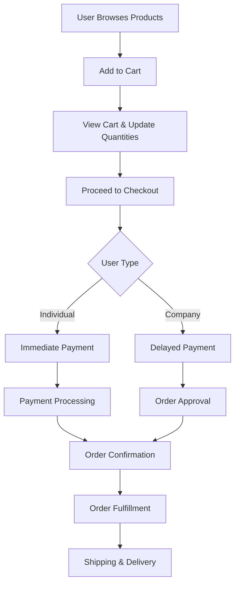
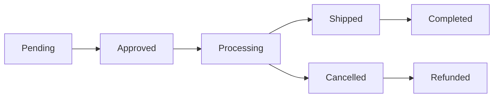
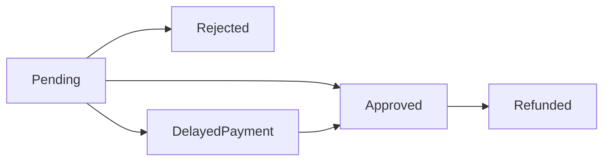


## 📋 **TradeO - Detailed Scenarios & Functionalities.md**

```markdown
# TradeO - Detailed Scenarios & Functionalities
## Comprehensive Business Logic Documentation

---

## 🔐 AUTHENTICATION & AUTHORIZATION SCENARIOS

### 1. User Registration & Role Management
**Scenario**: Admin manages user roles and company assignments
```csharp
// Role Management Workflow
1. Admin views all users with their current roles
2. Admin selects user for role modification
3. System shows available roles (Customer, Company, Admin, Employee)
4. If Company role selected → show company dropdown
5. Admin updates role/company → system validates changes
6. System updates Identity roles and user company association
```

**Business Logic**:
- Users can belong to only one role at a time
- Company users must be associated with a company
- Role changes trigger company assignment updates
- Admin users cannot be demoted via UI

### 2. User Lock/Unlock System
**Scenario**: Admin manages user account status
```csharp
// Lock/Unlock Logic
if (user.LockoutEnd > DateTime.Now) 
{
    // User is locked → unlock immediately
    user.LockoutEnd = DateTime.Now;
    message = "User Unlocked Successfully!";
}
else 
{
    // User is active → lock for 1000 years
    user.LockoutEnd = DateTime.UtcNow.AddYears(1000);
    message = "User Locked Successfully!";
}
```

---

## 🛍️ PRODUCT MANAGEMENT SCENARIOS

### 3. Product Creation & Validation
**Scenario**: Admin creates new product with image upload
```csharp
// Product Creation Workflow
1. Admin fills product form (name, description, price, category, seller)
2. System validates:
   - Name uniqueness per seller
   - Price > 0
   - DiscountPrice ≤ Price (if provided)
   - Category exists
3. Image upload processed:
   - Generate unique filename (GUID + extension)
   - Save to /wwwroot/images/products/
   - Store relative path in database
4. Product saved with image URL
```

**Validation Rules**:
- `Name`: Required, 3-100 characters, unique per seller
- `Price`: Required, range 0.01-1,000,000
- `DiscountPrice`: Optional, must be ≤ Price
- `Seller`: Required, max 50 characters
- `Image`: Optional, validated file type

### 4. Product Update with Image Management
**Scenario**: Admin updates existing product
```csharp
// Update Logic
1. Load existing product
2. Validate name uniqueness (excluding current product)
3. Check discount price logic
4. If new image provided:
   - Delete old image file from server
   - Upload and save new image
5. Update product details
6. Preserve existing image if no new upload
```

### 5. Product Filtering & Sorting
**Scenario**: Users browse products with various sort options
```csharp
// Sorting Options
- nameAsc/nameDesc: Alphabetical sorting
- priceAsc/priceDesc: By original price
- discountAsc/discountDesc: By discount price (falls back to original)
- sellerAsc/sellerDesc: By seller name
- newest/oldest: By product ID (creation order)
- Category filtering by categoryId
```

---

## 🛒 SHOPPING CART SCENARIOS

### 6. Add to Cart Functionality
**Scenario**: Customer adds product to shopping cart
```csharp
// Cart Addition Logic
1. User selects product and quantity (1-100)
2. System checks if product exists and is available
3. Check if product already in user's cart:
   - If exists → increment quantity
   - If new → create new cart item
4. Update session cart count
5. Show success message
```

**Session Management**:
```csharp
// Cart Count in Session
var cartCount = (await _unitOfWork.ShoppingCart
    .GetAll(c => c.ApplicationUserId == userId)).Count();
HttpContext.Session.SetInt32(SD.SessionCart, cartCount);
```

### 7. Cart Quantity Management
**Scenario**: Customer updates item quantities
```csharp
// Increase Quantity:
cartItem.Count += 1;
Update cart and save;

// Decrease Quantity:
if (cartItem.Count > 1) {
    cartItem.Count -= 1;
    Update cart;
} else {
    Remove item from cart;
    Update session count;
}
Save changes;
```

### 8. Cart Price Calculation
**Scenario**: System calculates cart totals
```csharp
// Price Logic
foreach (var cartItem in ShoppingCartList) 
{
    // Use discount price if available, otherwise regular price
    cartItem.Price = cartItem.Product.DiscountPrice ?? cartItem.Product.Price;
    OrderTotal += cartItem.Price * cartItem.Count;
}
```

---

## 💳 ORDER PROCESSING SCENARIOS

### 9. Checkout & Order Creation
**Scenario**: Customer completes purchase
```csharp
// Order Creation Workflow
1. Validate shopping cart items and quantities
2. Calculate order total using current prices
3. Determine payment type based on user role:
   - Individual Customer → Immediate payment required
   - Company User → Delayed payment (30 days)
4. Create OrderHeader with status:
   - Customer: Pending Payment, Pending Order
   - Company: Approved Order, Delayed Payment
5. Create OrderDetail records with price snapshot
```

### 10. Payment Processing Scenarios

#### Scenario 10.1: Individual Customer Payment
```csharp
// Immediate Payment Flow
1. Create Stripe Checkout Session
2. Redirect to Stripe payment page
3. After payment → verify payment status
4. Update order: Approved Status, Approved Payment
5. Clear user's shopping cart
6. Send order confirmation
```

#### Scenario 10.2: Company Delayed Payment
```csharp
// Delayed Payment Flow
1. Create order with "ApprovedForDelayedPayment" status
2. Set payment due date to 30 days from now
3. Company can pay later via order management
4. Order proceeds to fulfillment immediately
```

### 11. Order Management Scenarios

#### Scenario 11.1: Order Status Updates
```csharp
// Status Transition Logic
Start Processing: Pending → Processing
Ship Order: Processing → Shipped
Cancel Order: Various → Cancelled
```

#### Scenario 11.2: Order Fulfillment
**Scenario**: Admin processes and ships orders
```csharp
// Shipping Logic
1. Admin adds tracking number and carrier
2. System updates:
   - OrderStatus = "Shipped"
   - ShippingDate = DateTime.Now
   - If company user → PaymentDueDate = Now + 30 days
3. Notify customer of shipment
```

#### Scenario 11.3: Order Cancellation with Refunds
```csharp
// Cancellation Logic
if (order.PaymentStatus == SD.PaymentStatusApproved) 
{
    // Process automatic refund via Stripe
    var refundOptions = new RefundCreateOptions 
    {
        Reason = RefundReasons.RequestedByCustomer,
        PaymentIntent = order.PaymentIntentId
    };
    var refund = refundService.Create(refundOptions);
    Update order status to Cancelled + Refunded;
} 
else 
{
    // No payment captured → simple cancellation
    Update order status to Cancelled;
}
```

---

## 🏢 COMPANY MANAGEMENT SCENARIOS

### 12. Company CRUD Operations
**Scenario**: Admin manages business entities
```csharp
// Company Validation
- Name must be unique across all companies
- All contact fields are optional but validated when provided
- Phone number format validation
- Address fields length validation
```

### 13. Company-User Relationship Management
**Scenario**: System handles company-user associations
```csharp
// Role Change Impact
if (user role changed to Company) 
{
    Assign selected company to user;
}
if (user role changed from Company) 
{
    Remove company association;
}
if (user remains Company but company changed) 
{
    Update company association;
}
```

---

## 📊 ADMIN DASHBOARD SCENARIOS

### 14. Data Filtering & Sorting
**Scenario**: Admin views data with various filters
```csharp
// Order Filtering
- Filter by order status (Pending, Approved, Processing, Shipped, Cancelled)
- Admin/Employee see all orders
- Customers see only their orders
- Real-time status updates
```

### 15. Bulk Operations
**Scenario**: Admin performs batch actions
```csharp
// Available Bulk Operations
- Mass category updates
- Batch product status changes
- Multiple order status updates
- Bulk user role modifications
```

---

## 🔄 SYSTEM WORKFLOWS

### 16. Complete Shopping Workflow


### 17. Order Status Lifecycle


### 18. Payment Status Transitions


---

## ⚙️ TECHNICAL SCENARIOS

### 19. Image Management System
**Scenario**: Handle product images throughout lifecycle
```csharp
// Image Lifecycle
Create: Upload → Validate → Save → Store URL
Update: Check new image → Delete old → Save new → Update URL
Delete: Find image path → Delete file → Remove DB reference
Validation: File type, size, dimensions check
```

### 20. Database Seeding & Initialization
**Scenario**: Application first-time setup
```csharp
// DbInitializer Logic
1. Check for pending migrations → apply if any
2. Create roles if not exist (Customer, Company, Admin, Employee)
3. Create default admin user if not exist
4. Seed categories, products, companies
5. Assign admin user to Admin role
```

### 21. Error Handling & User Feedback
**Scenario**: System provides meaningful error messages
```csharp
// Feedback System
Success: Green alerts for successful operations
Error: Red alerts for failures with specific messages
Validation: Field-specific error messages with ModelState
Navigation: Intelligent redirects based on context
```

---

## 🔒 SECURITY SCENARIOS

### 22. Access Control Scenarios
```csharp
// Role-based Authorization
[Authorize(Roles = SD.Role_Admin)] → Full system access
[Authorize(Roles = SD.Role_Admin + "," + SD.Role_Employee)] → Limited admin access
[Authorize] → Authenticated users only
[Area("Admin")] → Admin area protection
```

### 23. Data Privacy Scenarios
**Scenario**: Protect user data based on roles
```csharp
// Data Access Rules
- Users see only their orders and cart
- Admins see all data across the system
- Company users see company-specific information
- Employee role has limited administrative access
```

---

## 📈 PERFORMANCE & SCALABILITY SCENARIOS

### 24. Efficient Data Loading
**Scenario**: Optimize database queries
```csharp
// Eager Loading Strategy
var orders = await _unitOfWork.OrderHeader.GetAll(
    includeProperties: "ApplicationUser,OrderDetails.Product"
);

// Selective Loading
var userWithCompany = await _unitOfWork.ApplicationUser.Get(
    u => u.Id == userId, 
    includeProperties: "Company"
);
```

### 25. Session Management
**Scenario**: Handle shopping cart efficiently
```csharp
// Session Optimization
- Store only cart count in session
- Cart data stored in database with user association
- Session cleared after order completion
- Automatic cart cleanup on logout
```

---

## 🚀 DEPLOYMENT & MAINTENANCE SCENARIOS

### 26. Configuration Management
**Scenario**: Environment-specific settings
```csharp
// Key Configurations
- Database connection strings
- Stripe API keys (different for dev/prod)
- File upload paths
- Session timeout settings
- Email service configurations
```

### 27. Database Migration Scenarios
**Scenario**: Schema updates and data migrations
```csharp
// Migration Strategy
1. Code-first migrations for schema changes
2. DbInitializer for seed data
3. Automatic migration application on startup
4. Backup strategy before major changes
```

---